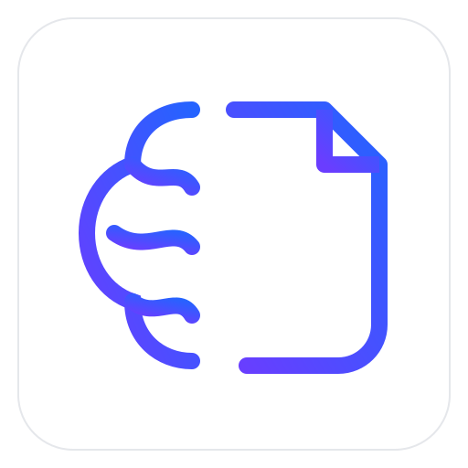
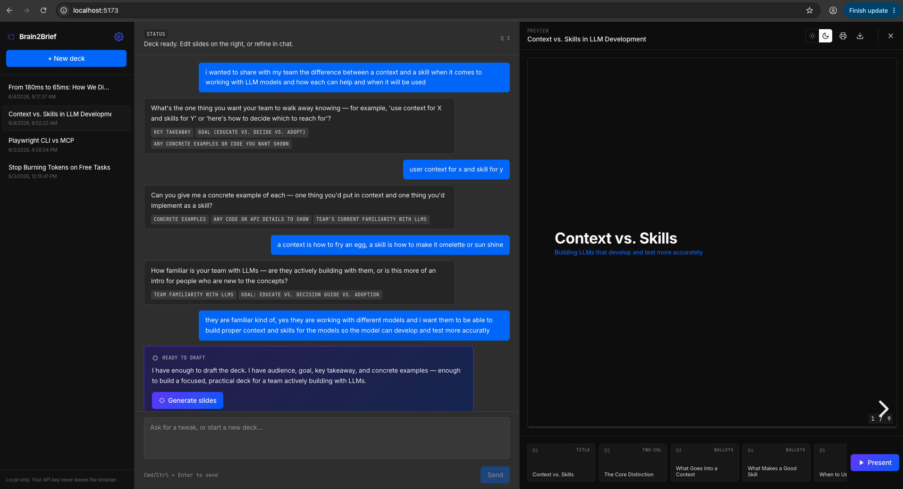
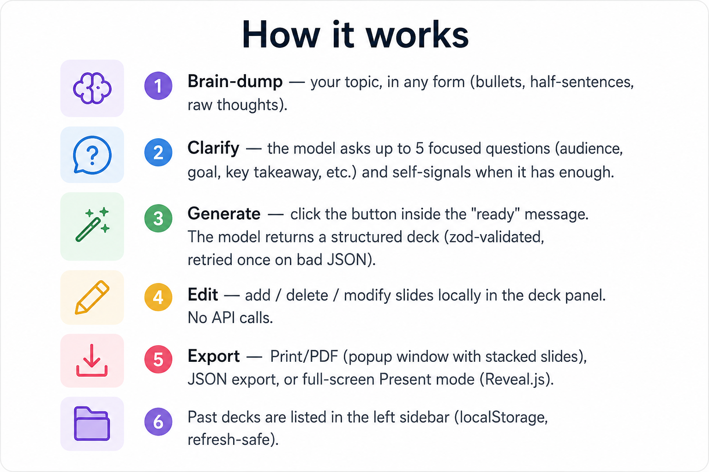

<p align="center">
  
</p>

<h1 align="center">Brain2Brief</h1>

<p align="center">
  Brain-dump a topic → answer a few clarifying questions → get a 1–10 slide deck.<br/>
  For engineers who get pulled into "can you demo this real quick" with no time to design slides.
</p>

<p align="center">
  <strong>100% local. No backend. Bring your own LLM API key.</strong>
</p>



## Quick start

```bash
git clone https://github.com/fityanos/Brain2Brief.git
cd Brain2Brief
npm install
npm run dev
```

Open `http://localhost:5173`. Click the gear icon → choose a provider → paste your API key → save. Or start with **Mock** mode (no key required) to try the flow.

## Providers

Pick one in Settings:

| Provider | Base URL | Notes |
|---|---|---|
| **Mock** | (none) | No key needed. Scripted Q&A + a deck built from your brain-dump text. Great for trying it out. |
| **Anthropic** | `https://api.anthropic.com/v1` | Use a key from [console.anthropic.com](https://console.anthropic.com). Default model: `claude-sonnet-4-6`. |
| **OpenAI-compatible** | any `/v1/chat/completions` endpoint | Works with OpenAI, OpenRouter, Ollama (`http://localhost:11434/v1`), LM Studio (`http://localhost:1234/v1`). |

Optional: copy `.env.example` to `.env.local` to pre-fill the Settings panel.

## Important :warning:
Brain2Brief is designed around your ideas. It doesn't search the web for answers or generate generic content. The slides are built from your thoughts, perspectives, and notes. If you want to incorporate external information, you can explicitly provide a URL and Brain2Brief will fetch and use that content.

## How your key is handled

- **Stored only in your browser's localStorage.** Never written to disk by this app, never sent anywhere except the LLM endpoint you configured.
- **No backend.** The browser calls the LLM provider directly.
- **No telemetry, no analytics.** Search the repo for `fetch(` — the only outbound calls are to your configured LLM endpoint and (for the print popup) Google Fonts.
- **CSP enforced in production builds.** See below.

## Content Security Policy

The production build (`npm run build`) injects a strict CSP into `index.html`:

- `script-src 'self'` — no inline scripts, no `eval`, no third-party JS
- `style-src 'self' 'unsafe-inline' https://fonts.googleapis.com` — inline styles allowed for React's `style={{...}}` props
- `font-src 'self' data: https://fonts.gstatic.com` — Inter + JetBrains Mono only
- `img-src 'self' data:` — only same-origin and bundled assets
- `connect-src` — same-origin, any `localhost` (for Ollama / LM Studio), and the three known remote providers (`api.anthropic.com`, `api.openai.com`, `openrouter.ai`)
- `form-action 'none'` — the app never submits a form
- `frame-ancestors 'none'` — cannot be embedded in an iframe
- `object-src 'none'`, `base-uri 'self'`

If you point Settings at a provider not in the `connect-src` list above, the browser will block the request. Edit the `CSP` constant in [`vite.config.ts`](vite.config.ts) to add the host, then rebuild.

The dev server (`npm run dev`) runs **without** CSP — Vite's HMR needs inline scripts. For a hardened local run, use:

```bash
npm run build
npm run preview
```

## How it works




## License

MIT — do whatever you like.
